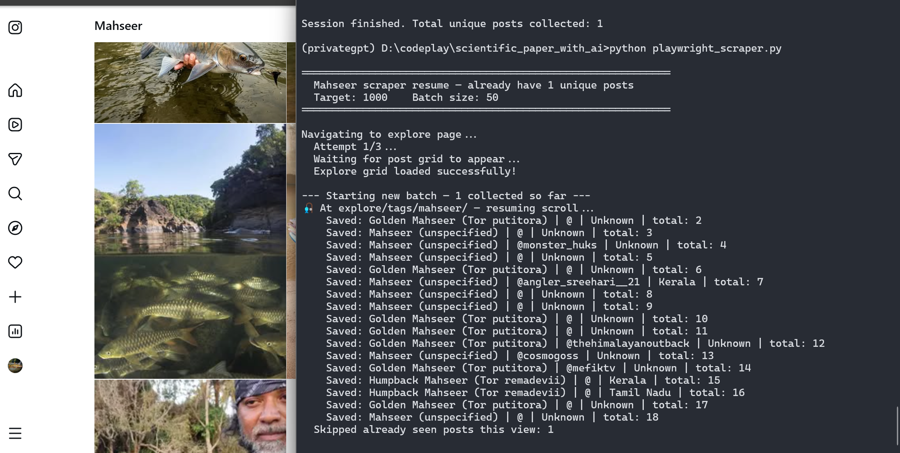

 # Scraping for academics
 


https://www.youtube.com/watch?v=wz8lg_3j3Ok

Here he suggests to use

chatgpt

ellicit

litmap

mendeley

scihub - to download as pdf

connected papers

docAnalyser.ai

We will try and apply this for the following: -

Objective 1

making changes to the ppt.

# using playwright

**Yes — the current code is already designed to handle stop-and-restart very gracefully**, so you can safely run it over several days (even weeks) without losing progress or creating massive duplicates.

Here’s exactly **why it survives restarts well** and what to watch out for:

| Feature                  | How it helps with restarts                                                                 | What survives across runs                  |
|--------------------------|---------------------------------------------------------------------------------------------|---------------------------------------------|
| `scanned_posts.txt`      | Stores every shortcode that was **processed** (success or failure)                          | Yes — all previously seen posts             |
| Persistent context folder (`./insta_session`) | Keeps cookies, local storage, login state (if you logged in manually once)                 | Yes — browser "memory" & scroll position    |
| `total_collected = len(load_memory())` | Automatically counts how many unique posts you already have at startup                     | Yes — correct resume count                  |
| Memory check before scraping | Skips any post whose shortcode is already in the file                                       | Prevents re-scraping old posts              |
| CSV append mode          | Only adds new rows — never overwrites old data                                              | All historical data preserved               |

### Realistic daily workflow (what most people do)

1. **Run in the evening**  
   `python your_script.py`  
   → let it collect 200–400 posts (or until you get tired / Instagram acts suspicious)

2. **Stop with Ctrl+C**  
   → script prints “Stopped by user”, saves the last shortcodes, context folder stays intact

3. **Next day / few hours later**  
   Run the same command again  
   → script  
     - loads all previous shortcodes  
     - re-opens the **same browser profile**  
     - goes back to the hashtag page  
     - continues scrolling from roughly where it left off (Instagram usually remembers position quite well in persistent context)

4. Repeat as many days as you want

### Things that survive perfectly

- All scraped data in CSV
- No duplicate rows (unless Instagram literally serves the same post twice with different shortcode — extremely rare)
- Login state (very important — if you log in manually once in the visible browser, it stays logged in across restarts)
- Approximate scroll depth (Instagram explore page usually loads the grid from where you were)

### Minor things that **reset slightly** (but not a problem)

- Exact scroll position isn’t 100% pixel-perfect after browser restart (Instagram reloads the page → you might see 10–50 already-scanned posts again at the top → they get skipped quickly)
- “Top posts” vs “Recent” tab sometimes flips (you can manually click “Recent” after restart if you prefer chronological order)

### Tips to make multi-day scraping even smoother

- **Never delete** `scanned_posts.txt` or the `insta_session` folder unless you deliberately want to start from zero.
- If Instagram logs you out or shows “Something went wrong” →  
  → manually log in again in the opened browser window  
  → the session folder will remember it for next runs
- Every 2–3 days consider a longer forced break (24+ hours) — helps avoid soft shadow-bans.
- Optional: add this line at the very beginning of the script (after imports) to see progress on startup:

```python
print(f"Resuming — already have {len(load_memory())} unique posts in memory.")
```

- If you ever want to **force fresh start** (new dataset, forget everything):
  ```bash
  rm scanned_posts.txt
  rm -rf insta_session/
  rm mahseer_master_dataset.csv
  ```

Bottom line:  
**Yes — you can comfortably stop and restart the program over multiple days.**  
The way it’s written right now is already one of the more restart-friendly Instagram scrapers people use in 2025–2026.

Just run it whenever you have time, stop when you want, and it will pick up more or less where it left off.

If you notice it starting to re-process way too many posts after a restart (very unusual), share roughly how many lines are in `scanned_posts.txt` and I can help diagnose. Otherwise — you’re good to go for a long multi-day run. Happy (and patient) scraping! 🎣

